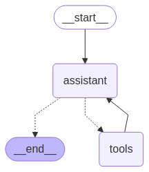

# E-Commerce Expert Assistant

Welcome to the E-Commerce Expert Assistant! This project implements a chatbot that serves as a smart e-commerce assistant, capable of answering questions about both product details and order information using a microservices architecture.

## Table of Contents
- [Architecture Overview](#architecture-overview)
- [Services](#services)
  - [Chat Service](#chat-service)
  - [Product Service](#product-service)
  - [Order Service](#order-service)
  - [Mock API](#mock-api)
- [Features](#features)
- [Installation](#installation)
- [Usage](#usage)
- [Sample Questions & Responses](#sample-questions--responses)
- [API Documentation](#api-documentation)
- [Development Process](#development-process)
- [Versioning](#versioning)

## Architecture Overview

This project implements a microservices architecture with the following components:

```
E-Commerce Expert Assistant
├── Chat Service (Port 8003)
│   └── LangGraph + Cohere LLM integration
├── Product Service (Port 8001)
│   └── RAG-powered retrieval for product information
├── Order Service (Port 8002)
│   └── Order data retrieval via Mock API
└── Mock API (Port 8000)
    └── Order data access layer
```

Each service is deployed independently and communicates via RESTful APIs. The architecture allows for easy scaling and maintenance of individual components.

## Services

### Chat Service

The Chat Service is the main interface for users to interact with the chatbot. It routes user queries to the appropriate backend services and integrates a large language model (Cohere) with RAG capabilities.

The Graph compiled to this project is simple yet powerful.


<p align="center"></p>

**Key Features:**
- Gradio UI for easy interaction
- LangGraph for orchestrating interactions with backend services
- Tools for querying product and order information
- Conversational memory to maintain context across interactions

**API Endpoints:**
- `GET /`: Health check endpoint
- `POST /chat`: Process user messages and generate responses
- `GET /ui`: Gradio interface for chatting

### Product Service

The Product Service handles product information retrieval using RAG (Retrieval Augmented Generation) techniques. It uses vector embeddings to perform semantic search on product data.

**Key Features:**
- Vector store for semantic search using FAISS
- Pre-built index for fast retrieval
- Category-based filtering
- Rating-based recommendations

**API Endpoints:**
- `GET /`: Health check endpoint
- `GET /search`: Search products based on text query
- `GET /search/category`: Search products within a specific category
- `GET /top-rated`: Get top-rated products with optional category filtering

### Order Service

The Order Service interfaces with the Mock API to retrieve and process order information. It provides a clean abstraction layer over the order data.

**Key Features:**
- Customer order history retrieval
- Product-specific order lookup
- High-priority order identification
- Order analytics

**API Endpoints:**
- `GET /`: Health check endpoint
- `GET /customer/{customer_id}`: Get all orders for a specific customer
- `GET /customer/{customer_id}/recent`: Get most recent order for a customer
- `GET /customer/{customer_id}/product`: Get orders for a specific product
- `GET /high-priority`: Get high-priority orders
- `GET /total-sales-by-category`: Get sales data by product category
- `GET /high-profit-products`: Get high-profit products
- `GET /shipping-cost-summary`: Get shipping cost statistics
- `GET /profit-by-gender`: Get profit data by gender

### Mock API

The Mock API simulates a database service for order information. It provides direct access to the Order Data Dataset.

**Key Features:**
- Filtering by customer ID, product category, and order priority
- Sales and profit analytics
- Shipping cost summaries

**API Endpoints:**
- `GET /`: Health check endpoint
- `GET /data`: Get all order data
- `GET /data/customer/{customer_id}`: Get orders for a specific customer
- `GET /data/product-category/{category}`: Get orders by product category
- `GET /data/order-priority/{priority}`: Get orders by priority level
- `GET /data/total-sales-by-category`: Get sales by product category
- `GET /data/high-profit-products`: Get high-profit products
- `GET /data/shipping-cost-summary`: Get shipping cost summary
- `GET /data/profit-by-gender`: Get profit data by gender

## Features

1. **RAG-Powered Product Search**: Semantic search for products using embeddings and vector database.
2. **Order Lookup**: Query order details by customer ID, product, or priority.
3. **Conversational Interface**: Natural language interaction with memory to maintain context.
4. **Microservices Architecture**: Modular design for easy scaling and maintenance.
5. **Gradio UI**: Simple web interface for testing the chatbot.

## Installation

1. Clone the repository:
```bash
git clone https://github.com/Joyboyyya/Ecommerce_Assistant_Challenge-2025_v2.git
cd Ecommerce_Assistant_Challenge-2025_v2
```

2. Create a virtual environment and install dependencies:
```bash
python(or use python3) -m venv (You can either install it inside or outside the main folder, outside is preferred)
source venv/Scripts/activate (Change according to the OS you use!)
pip install -r requirements.txt
```

3. Set up environment variables (create a `.env` file in the project root):
```
COHERE_API_KEY=your_cohere_api_key
PRODUCT_SERVICE_URL=http://localhost:8001
ORDER_SERVICE_URL=http://localhost:8002
MOCK_API_URL=http://localhost:8000

Add other variables as per requirements!
```

4. Start the services in different terminals:
```bash
# Start Mock API
cd mock_api
uvicorn mock_api:app --host 0.0.0.0 --port 8000

# Start Product Service
cd services/product_service
uvicorn main:app --host 0.0.0.0 --port 8001

# Start Order Service
cd services/order_service
uvicorn main:app --host 0.0.0.0 --port 8002

# Start Chat Service
cd services/chat_service
uvicorn main:app --host 0.0.0.0 --port 8003
```

## Usage

### Web Interface

1. Open your browser and navigate to `http://localhost:8003/ui`
2. Type your query in the text box and press Enter or click Send
3. Example queries:
   - "What are the top 5 highly-rated guitar products?"
   - "What's a good product for thin guitar strings?"
   - "What are the details of my last order? (Customer ID: 37077)"

### API Usage

You can also interact with the chatbot via API:

```bash
curl -X POST http://localhost:8003/chat \
  -H "Content-Type: application/json" \
  -d '{"message": "What are the top 5 highly-rated guitar products?", "thread_id": null}'
```

## Deployment

I have deployed my project in AWS EC2 instance. I have included all the links which will be active as long as I keep up the EC2 Instance in the cloud.

| Service             | URL                                                                  |
| ------------------- | -------------------------------------------------------------------- |
| 🛒 Product Service  | [http://54.209.242.5:8000](http://54.209.242.5:8000)                   |
| 📦 Order Service    | [http://54.209.242.5:8002](http://54.209.242.5:8002)                   |
| 📊 Mock API         | [http://54.209.242.5:8001](http://54.209.242.5:8001)                   |
| 💬 Chat Service     | [http://54.209.242.5:8003](http://54.209.242.5:8003)              |
| 💬 Chat UI (Gradio) | [http://54.209.242.5:8003/ui](http://54.209.242.5:8003/ui) (as seen running) |


## Sample Questions & Responses

### Product Dataset Queries

**Query**: "What are the top 5 highly-rated guitar products?"

**Response**:
```
The top 5 highly-rated guitar products I could find are:

Fender FA-125 Acoustic Guitar Bundle - a full-size guitar with a natural finish, suited to all styles of music
Imelod Zinc Alloy Guitar Capo Shark Capo - a gold-coloured capo suitable for acoustic and electric guitars
Martin Guitar Lifespan 2.0 MA150T Acoustic Strings - 80/20 bronze, medium-gauge strings for acoustic guitars
Perri's Leathers Guitar Picks - AC/DC-themed 12-pack of medium picks, suitable for acoustic, bass and electric guitars
Another guitar accessory is the Fender FA-115 Dreadnought Acoustic Guitar Bundle, which comes in black.

```

**Query**: "What's a good product for thin guitar strings?"

**Response**:
```
There are a few options for thin guitar strings:

Martin Guitar Lifespan 2.0 MA150T Acoustic Strings - these are medium-gauge, 80/20 bronze strings, which are described as bright and suitable for all playing styles.
Martin MSP4200 Phosphor Bronze Wound Acoustic Guitar Strings - another medium-gauge option, with a bronze winding alloy, designed to deliver deep bases and bright trebles.
Belfort Guitar Strings - a 6-string set made of nylon and silver, with the added bonus of 4 picks. These strings are designed for maximum flexibility.
```

**Query**: "Is the BOYA BYM1 Microphone good for a cello?"

**Response**:
```
I've found the BOYA BYM1 Microphone - it's a clip-on lapel microphone that's compatible with a range of devices including iPhones, Android smartphones, tablets and DSLRs. It's described as ideal for video and audio recording.

However, I couldn't see any reference to its suitability for a cello. I'm afraid this product doesn't appear to be designed with cellos in mind.
```

### Order Dataset Queries

**Query**: "What are the details of my last order?"

**Response**:
```
Sure, I can help with that! Could you please provide your Customer ID?
```

**User**: "37077"

**Response**:
```
Your most recent order, XXXX, was placed on 02/01/2018. It included one Car Media Player, and was paid for using a credit card.

```

**Query**: "Fetch 5 most recent high-priority orders."

**Response**:
```

Here are the details of the 5 most recent high-priority orders:

Order Time: 23:11:40, Product: Car Pillow & Neck Rest, Quantity: 1, Payment: Money Order
Order Time: 23:02:01, Product: Tyre, Quantity: 5, Payment: Credit Card
Order Time: 22:38:45, Product: Shirts, Quantity: 5, Payment: Credit Card
Order Time: 20:22:57, Product: Suits, Quantity: 5, Payment: Credit Card
Order Time: 20:18:43, Product: Car & Bike Care, Quantity: 1, Payment: Credit Card

Let me know if you'd like more details about any of these orders!
```

**Query**: "What is the status of my car body covers?"

**Response**:
```
Please provide your Customer ID to check the status of your car body cover order.
```

**User**: "My Customer ID is 37077."

**Response**:
```
I'm afraid I couldn't find any information about the status of car body covers orders. I did find one order you placed for Auto & Accessories, but it didn't mention car body covers. I apologise for any inconvenience.

Is there anything else I can help you with?

```

## API Documentation

### Chat Service API

- `GET /`: Health check endpoint
  - Response: `{"message": "E-commerce Chatbot Service API", "status": "running"}`

- `POST /chat`: Process user messages
  - Request Body: `{"message": "string", "thread_id": "string"}`
  - Response: `{"message": "string", "thread_id": "string"}`

  You can check each endpoint by navigating to (http://54.209.242.5:8003/docs or http://localhost:8003/docs)

### Product Service API

- `GET /`: Health check endpoint
  - Response: `{"message": "Product Search Service API", "status": "running"}`

- `GET /search`: Search products
  - Parameters: `query` (string), `top_k` (integer, default=5)
  - Response: `{"query": "string", "results": [...], "count": integer}`

- `GET /search/category`: Search by category
  - Parameters: `category` (string), `query` (string), `top_k` (integer, default=5)
  - Response: `{"category": "string", "results": [...], "count": integer}`

- `GET /top-rated`: Get top-rated products
  - Parameters: `category` (string, optional), `min_rating` (float, default=4.5), `top_k` (integer, default=5)
  - Response: `{"category": "string", "min_rating": float, "results": [...], "count": integer}`

You can check each endpoint by navigating to (http://54.209.242.5:8001/docs or http://localhost:8001/docs)


### Order Service API

- `GET /`: Health check endpoint
  - Response: `{"message": "Order Service API", "status": "running"}`

- `GET /customer/{customer_id}`: Get customer orders
  - Parameters: `customer_id` (integer)
  - Response: `{"customer_id": integer, "orders": [...], "count": integer}`

- `GET /customer/{customer_id}/recent`: Get most recent order
  - Parameters: `customer_id` (integer)
  - Response: `{"customer_id": integer, "order": {...}}`

- `GET /customer/{customer_id}/product`: Get product orders
  - Parameters: `customer_id` (integer), `product_keyword` (string)
  - Response: `{"customer_id": integer, "product_keyword": "string", "orders": [...], "count": integer}`

- `GET /high-priority`: Get high-priority orders
  - Parameters: `limit` (integer, default=5)
  - Response: `{"orders": [...], "count": integer}`

  You can check each endpoint by navigating to (http://54.209.242.5:8002/docs or http://localhost:8002/docs)


## Development Process

The development process followed these key steps:

1. **Planning and Task Breakdown**: Initial planning to break the project into manageable tasks and estimate time requirements.
2. **Architecture Design**: Designing the microservices architecture with clear separation of concerns.
3. **Product Service Implementation**: Building the RAG-powered product search service.
4. **Order Service Implementation**: Creating the order lookup service with Mock API integration.
5. **Chat Service Integration**: Developing the chatbot interface and integrating backend services.
6. **Testing**: Comprehensive testing of all components and integration points.
7. **Deployment**: Deploying all services and ensuring proper communication.
8. **Documentation**: Creating thorough documentation of the system.

## Versioning

The project uses Git tags to mark important milestones in development:

- v0.1: Initial project setup and structure
- v0.2: Data Preprocessing & Basic Mock API implementation
- v0.3: Product Service with RAG capabilities
- v0.4: Order Service with API client
- v0.5: Chat Service with basic LLM integration & UI implementation with Gradio
- v0.6: Deployment & Integration of all services
- v1.0: Complete system with documentation

## Future Work

Several enhancements are planned for future iterations of this project:

1. **Agent Flow Tracking**: Implement Langsmith or PhoenixAI for better visualization and tracking of agent workflows and decision-making processes.

2. **RAG and Agent Evaluation**: Develop robust evaluation frameworks to measure:
   - Tool selection accuracy (whether agents are calling the appropriate tools)
   - Retrieval precision and recall metrics
   - Overall response quality and relevance

3. **MCP Server Implementation**: Develop Model Control Protocol servers for both product and order services to use with development environments like Cursor AI or Windsurf for improved efficiency.

4. **Hallucination Reduction**: Currently, the system implements parallel requests and selects the first best response to mitigate hallucination issues. Future work will focus on more sophisticated techniques to reduce this inefficiency.

5. **Enhanced UI**: Develop a custom user interface with additional features for a better user experience.

6. **Additional Data Sources**: Integrate with more data sources to expand the chatbot's knowledge base and capabilities.
